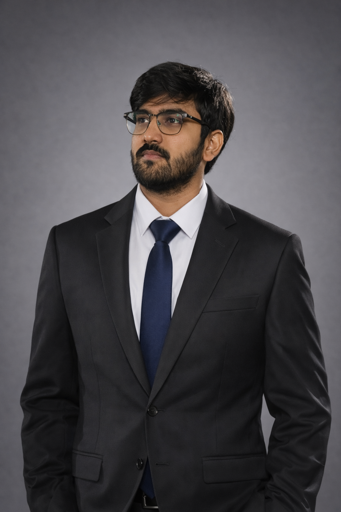

<div align="center">
  
</div>

<div align="center">

```
██████╗ ██╗██████╗ ██╗  ██╗ █████╗ ██╗   ██╗    ███████╗ ██████╗ ███╗   ██╗██╗
██╔══██╗██║██╔══██╗██║  ██║██╔══██╗██║   ██║    ██╔════╝██╔═══██╗████╗  ██║██║
██████╔╝██║██████╔╝███████║███████║██║   ██║    ███████╗██║   ██║██╔██╗ ██║██║
██╔══██╗██║██╔══██╗██╔══██║██╔══██║╚██╗ ██╔╝    ╚════██║██║   ██║██║╚██╗██║██║
██║  ██║██║██████╔╝██║  ██║██║  ██║ ╚████╔╝     ███████║╚██████╔╝██║ ╚████║██║
╚═╝  ╚═╝╚═╝╚═════╝ ╚═╝  ╚═╝╚═╝  ╚═╝  ╚═══╝      ╚══════╝ ╚═════╝ ╚═╝  ╚═══╝╚═╝
```

**ML Engineer · AI Researcher · Founder**

*Building proprietary AI ventures in Financial Intelligence and Startup Analytics*

[](mailto:ribhavsoni19@gmail.com)
[](https://github.com/Ribhav19)


</div>

---

## About

ML Engineer and AI Researcher with a **9.8/10 GPA**, **4 international research papers**, and **2 production internships** — currently building proprietary AI ventures at the intersection of Financial Intelligence, LLM systems, and Reinforcement Learning.

Alongside my engineering career, I'm the **Founder** of multiple stealth AI startups launching soon — FinVision AI, ScaleSmart AI, FinTorr, and a proprietary 6B-parameter foundation model — all built from the ground up with production-grade architecture.

---

## Ventures *(Proprietary · Launching Soon)*

### [FinVision AI](https://github.com/Ribhav19/FinSight-AI) — Founder & Lead AI Engineer
> Enterprise financial intelligence platform — balance sheet analysis, risk scoring, legal compliance, and AI-generated strategic reports

`FinBERT` `LegalBERT` `RAG` `PyTorch` `FastAPI` `Gradio`

---

### [ScaleSmart AI](https://github.com/Ribhav19/scalesmart-ai) — Founder & Lead AI Engineer
> Holistic startup risk scoring platform for founders and VCs — financial, legal, sectoral, and investor intelligence with explainable AI decisions

`FinBERT` `LegalBERT` `LSTM` `RL` `SHAP` `LIME` `Cloud-native`

*Research presented at ICRATM 2026*

---

### [FinTorr](https://github.com/Ribhav19/financial-intelligence-platform) — Founder & Lead AI Engineer
> AI-driven market intelligence platform — fundamental, technical, and sentiment analysis with RL trading logic and paper trading simulation

`PyTorch` `TensorFlow` `RL` `CNN-BiLSTM` `React` `Node.js`

---

### [Cognitive Foundation Model — 6B](https://github.com/Ribhav19/cognitive-foundation-model) — Founder & Lead Researcher
> 6B-parameter foundation LLM trained entirely from scratch — no pre-trained base, no fine-tuning — using a proprietary cognitive training framework

`PyTorch` `HuggingFace` `Distributed Training` `GPU Inference` `RAG`

---

## Tech Stack

**Languages**


**Frameworks & Libraries**


**AI / ML Domains**


---

## Experience

**Machine Learning Engineer Intern** — *Bluebase AI (Mumbai)* `May 2025 – Feb 2026`
- Designed and deployed scalable ML pipelines across production environments
- Built end-to-end data workflows: preprocessing, feature engineering, training, and evaluation
- Engineered production-grade infrastructure using Docker and cloud platforms
- Collaborated cross-functionally to integrate AI solutions into core business workflows

**Data Science & Generative AI Intern** — *Aperture Technologies (Pune)* `Dec 2024 – Apr 2025`
- Developed data-driven solutions using ML, statistical modeling, and LLMs
- Built automated data pipelines and analysis workflows for scalable insights

---

## Research & Accomplishments

| | |
|---|---|
| 📄 | Research paper presented at **ICTIS 2026**, Thailand |
| 📄 | Research paper accepted — **Microsoft CMT 2026** |
| 📄 | Research paper presented at **HLNWEIS ARET 2026** |
| 📄 | Research paper presented at **ICRATM 2026** |
| 🏆 | Winner — **Barclays Hackathon** |
| 🏆 | Winner — multiple national AI/ML and Data Science hackathons |
| 🎓 | B.E. Information Technology, PICT Pune — **9.8 / 10 GPA** |

---

## Certifications

- AI & Machine Learning Specialization (Advanced)
- Deep Learning & NLP Specialization — Transformers, Sequence Models
- Cloud Computing Certification — AWS / GCP / Azure
- Data Science & Analytics Certification

---

```
Current Focus
─────────────────────────────────────────────────────
Proprietary AI Ventures    Financial Intelligence AI
LLM Architecture           RAG + Multi-Agent Systems
Reinforcement Learning     Production ML Infrastructure
```

---

<div align="center">

*Open to ML Engineer, AI Researcher, and AI/ML roles — building in stealth, shipping soon*

[](mailto:ribhavsoni19@gmail.com)

</div>
